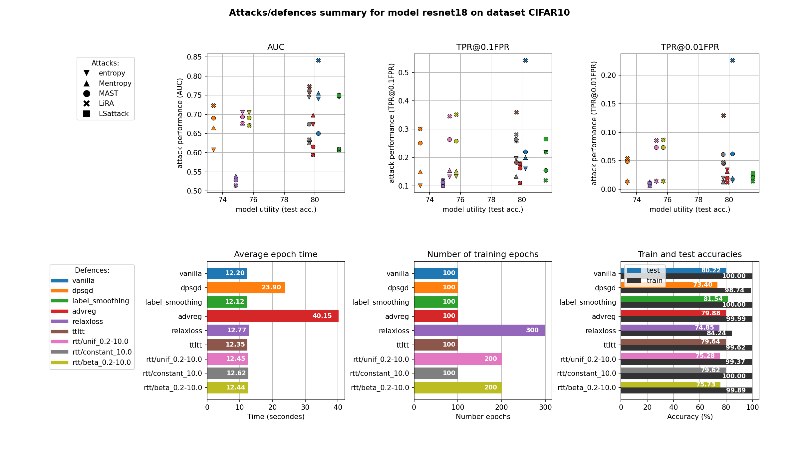

**MIAs and defences**
===

This packages enables to compare the effect of Membership Inference Attacks (MIAs) against different defence mechanisms, for different datasets and different models architectures.


For instance:



Currently implemented MIAs:   
*  Entropy and Modified-entropy from [Song et al. "Systematic Evaluation of Privacy Risks of Machine Learning Models" (2020)](https://arxiv.org/abs/2003.10595)
*  MAST from [Sablayrolles et al. "White-box vs Black-box: Bayes Optimal Strategies for Membership Inference" (2019)](https://arxiv.org/abs/1908.11229)
*  LiRA from [Carlini et al. "Membership Inference Attacks From First Principles" (2022)](https://arxiv.org/abs/2112.03570)

Currently implemented defences against MIAs:
*  Vanilla (undefended training)
*  DP-SGD from [Abadi et al. "Deep Learning with Differential Privacy" (2016)](https://arxiv.org/abs/1607.00133)
*  Label smoothing, see [towardsdatascience: What is label smoothing?](https://towardsdatascience.com/what-is-label-smoothing-108debd7ef06)
*  Adversarial regularization from [Nasr et al. "Machine Learning with Membership Privacy using Adversarial Regularization" (2018)](https://arxiv.org/abs/1807.05852)
*  RelaxLoss from [Chen et al. "RelaxLoss: Defending Membership Inference Attacks without Losing Utility" (2022)](https://arxiv.org/abs/2207.05801)
*  Random Temperature Tuning, personal idea: for each training sample $(x_i, y_i)$ draw a fixed temperature $t_i$ from a given temperature distribution $T$ so that each training sample is now a triple $(x_i, y_i, t_i)$. At training time, use these temperatures to rescale the softmax activation function at the output of the neural network, i.e., during training the outputted probabilities $\{p_{i, j}\} _{j\in 1, \dots, C}$ of sample $i$ are rescaled into $\tilde p_{i,j} := \frac{p_{i,j}^{1/t_i}}{\sum_j p_{i,j}^{1/t_i}}$. The loss is computed on these rescaled probabilities. At inference time, a temperature of $1$ is given to each sample. The idea was to introduce more randomness for a better defence, but without changing the probabilities relative ratios in order to preserve utility.

Available datasets:
*  CIFAR10
*  CIFAR100

Available model architectures:
*  Simple MLP with few layers
*  ResNet: resnet18, resnet50 ... ( **!!!** current ResNets use a kernel of size $3\times 3$ inside the first convolutional layer to work with the small $32\times 32$ px images of CIFAR)
*  VGG: vgg11, vgg13 ... (the versions using batch normalization are named vgg11_bn, vgg13_bn ...)

___

## **1. Running MIAs and defences**
### **1.1. Full defences-attacks-comparisons pipeline**

To run target models training, i.e. defences, then run MIAs in order to attack those defences, and to get finally a cross-comparison summary, use:  
```
python main.py --model resnet 18 --dataset CIFAR10 --random_seed 123 --defences all --attacks all
```

If you just want to run some defences and/or some attacks, you can replace `all` with a space-seperated list of defences/attacks, like:   
```
python main.py --model resnet 18 --dataset CIFAR10 --random_seed 123 --defences vanilla dpsgd advreg --attacks Mentropy LiRA
```

In case you just want to train the defences, or just run the attacks, or just perform the cross-comparisons between trained defences and attacks you can use the `--mode` option with respectively `defences`, `attacks` or `comparisons`. For instance:  
```
python main.py --model resnet 18 --dataset CIFAR10 --random_seed 123 --defences all --attacks all --mode comparisons
```

To get further details about the options, you can have a look at the `parse_arguments()` function inside the `main.py` file.

### **1.2. Resulting outputs and figures**

For each defended model, for each attack and for the final defences-attacks cross-comparisons, several folders and files are created inside the `results/` folder. More precisely, results are ordered by model architecture, then dataset and then the random seed of the experiment, like `results/resnet18/CIFAR10/seed111/`.   
Inside this experiment folder, there are two sub-folders for the defences and the attacks, containing in particular the trained model and accuracy and loss training curves, see below.
***Most important, attacks performances on defences can be seen in the following files:***  
*  ***the ROC curves comparing attacks against one defence are located at*** `results/[model_architecture]/[dataset]/[seed]/defences/[defence_name]/attacks/ROC.png`  
*  ***the ROC curves comparing one attack against several defences are located at*** `results/[model_architecture]/[dataset]/[seed]/ROC_[attack_name].png`  
*  ***a general summary of all attacks and defences is located at*** `results/[model_architecture]/[dataset]/[seed]/summary.png`  


Example of files generated for one experiment:

```
results/resnet18/CIFAR10/seed111
├─ attacks
│  ├─ lira
│  │  ├─ shadows
│  │  │  ├─ 000 // each of these folder contains one shadow model
│  │  │  ├─ ...
│  │  │  └─ 064
│  │  │     │  acc.png
│  │  │     │  done.txt // indicates that this folder is completed
│  │  │     │  log.txt
│  │  │     │  loss.png
│  │  │     └  model.pt
│  │  │  
│  │  │  done.txt
│  │  │  IN_OUT_confs__nb_challengers=5000.pkl
│  │  │  IN_shadow_models__nb_challengers=5000.pkl
│  │  │  lira.py // copy of the script used to generate this folder
│  │  │  params.yml
│  │  └  shadow_datasets_idx__nb_challengers=5000.pkl
│  │  
│  └─ mast
│     │  done.txt
│     │  IN_OUT_losses__nb_challengers=5000.pkl
│     │  mast.py // copy of the script used to generate this folder
│     └  params.yml // hyperparameters
│  
├─ defences  
│  ├─ advreg
│  ├─ dpsgd
│  ├─ ...
│  └─ vanilla
│     ├─ attacks // this folder contains all attacks results performed
│     │  │       // onto the associated target model (here vanilla)
│     │  ├─ challengers // challenger features used to run attacks
│     │  │  │  labels.npy
│     │  │  │  logits.npy
│     │  │  │  losses.npy
│     │  │  │  mem_or_nmem.npy
│     │  │  │  pred_labels.npy
│     │  │  └  probits.npy
│     │  │  
│     │  ├─ fpr_tpr // FPR and TPR of the attacks
│     │  │  │  entropy.npy
│     │  │  │  ...
│     │  │  └  LiRA.npy
│     │  │ 
│     │  ├─ metrics // attack metrics
│     │  │  │  entropy.npy
│     │  │  │  ...
│     │  │  └  LiRA.npy
│     │  │
│     │  │  done.txt
│     │  └  ROC.png // ROC of all attacks against this defence (here vanilla)
│     │  
│     │  acc.png
│     │  done.txt // indicates that this folder is completed
│     │  log.txt
│     │  loss.png
│     │  model.pt
│     │  params.yml // hyperparameters
│     └  vanilla.py // copy of the script used to generate this folder
│  
│  ROC_entropy.png // ROC of one attack (here entropy) against all defences
│  ...
│  ROC_LiRA.png
└  summary.png
```

### **1.3. Running files seperately**

In case you want to test defences or attacks alone, you can directly run the corresponding Python scripts, as describe hereunder.  
Nevertheless, notice that these standalone experiences are not directly managed from the `main.py` script, and that in case a complete pipeline is rerun from the `main.py` script, some of the standalone experiences might be relaunched/lost. In order to avoid an overwritting of an experiment, you can add a `done.txt` inside the results folder of that defence or attack, or you can use a different random seed.
***Using a different random seed is recommended for such standalone experiences.***

#### **1.3.1. Only defences**

Defences are located in the `defences/` folder. Details about specific defence parameters can be found in the `parse_arguments()` function of every defence. For example, to run a label smoothing training use:  
```
python defences/label_smoothing.py --model resnet18 --dataset CIFAR10 --random_seed 111 --nb_epochs 100
```

#### **1.3.2. Only attacks**

Attacks are located in the `attacks/` folder or directly implemented inside the `attacks/run_attacks.py` script. So, depending on the complexity of the attack, one or two scripts are needed.

For MAST and LiRA, a first script needs to be run to train the associated shadow models, for instance:
```
python attacks/lira.py --model resnet18 --dataset CIFAR10 --random_seed 111 --nb_epochs 100 --nb_shadows 32
```

***Notice that the training of LiRA shadow models can be interrupted, and then restarted later on using the same command line, in case just part of shadow models were trained (thereby not all shadow models are retrained from scratch).***

***In the current implementation, MAST shadow models are the OUT shadow models of LiRA, so LiRA first needs to be run in order to run MAST.***

To compute the scores (especially TPR and FPR) of all the attacks for a given defended target model, the `run_attacks.py` needs to be run, like:
```
python attacks/run_attacks.py --model resnet18 --dataset CIFAR10 --random_seed 111 --defence vanilla --attacks all
```

If you just want to run some attacks, you can replace `all` with a space-seperated list of attacks.

***When the `main.py` script is called to run the attacks, it runs both the specific attack as for LiRA, and then runs the `run_attacks.py` script.***

___

## **2. Extending the package**

It is possible and supposed to be fairly easy to extend this package in order to add other defences, other attacks, other datasets or other model architectures. Here are explainations to add one of these:

### **2.1. How to add a defence?**
1.  Create a Python script in the `defences/` folder using the `defences/vanilla.py` script as a template (make especially sure that the `save_dir` variable defined in the `check_args()` function is the right one).
2.  In `main.py`, add the name of the defence (identical to the name of the script) to the `available_defences` variable at the top of the `main.py` script.  


### **2.2. How to add an attack?**
1.  Currently implemented attacks are producing membership scores for each challenger instance. So, a new attack is expected to do the same. In case the generation of these scores needs extra computations (like for LiRA), create a Python script in the `attacks/` folder for the "pre-computations" needed for this new attack (make especially sure that the `save_dir` variable defined in the `check_args()` function is the right one).
2.  The scores are computed (or retrieved) inside the `attacks/run_attacks.py` script. Add the  name of the attack to the `choice` argument of the `--attacks` option inside the `parse_arguments()` function.
3.  In `attacks/run_attacks.py`, add the short name and extended name to the `attacks_name` dictionnary of the `Attacks` class.
4.  In `attacks/run_attacks.py`, add a `__get_[attack_name](self)` function to the `Attacks` class that returns an np.array with the membership scores for all the challengers (the higher the score, the more likely a challenger is a member).
5.  In `attacks/run_attacks.py`, inside the `get_scores(self, attacks)` function of the `Attacks` class, add the code line:
```
if 'ATTACK_NAME' in attacks : scores['ATTACK_NAME'] = self.__get_ATTACK_NAME()
```
6.  In `main.py`, add the name of the attack to the `available_attacks` variable at the top of the `main.py` script. 

### **2.3. How to add a dataset?**
1.  In case you want to define a specific `torch.utils.data.Dataset` for the new dataset, create a Python script for such a class inside the `utils/datasets/` folder (`utils/datasets/cifar.py` can be taken as example).
2.  In the `utils/datasets/loader.py` script, add a `__[dataset_name](self)` function to the `DatasetLoader` class (the `__cifar10(self)` function can be taken as an example). This function has to define the following attributes:
  *  `self.nb_classes`: number of classes of the dataset
  *  `self.tr_set`: a `torch.utils.data.Dataset` of the training data
  *  `self.te_set`: a `torch.utils.data.Dataset` of the test data
  *  `self.s_tr_set`: a `torch.utils.data.Dataset` of shadow training data (used to trained the shadow models for LiRA for instance, this can be the same as the training data if case you don't have enough data)
  *  `self.s_te_set`: a `torch.utils.data.Dataset` of shadow test data
  *  `self.chal_set`: a `torch.utils.data.Dataset` of shadow test data
  *  `self.dataloader`: a `torch.utils.data.DataLoader` to use for the above Datasets, defining especially the batchsize to use for this dataset.
3.  In `utils/datasets/loader.py`, in the `__init__(self, ...)` function of the `DatasetLoader` class, add the following code lines:
```
elif dataset_name == 'DATASET_NAME':
    self.__DATASET_NAME()
```
4.  In `main.py`, add the name of the dataset to the `available_datasets` variable at the top of the `main.py` script. 

### **2.4. How to add a model architecture?**
1.  Add a new Python script defining the new model architecture inside the `utils/models/` folder (`utils/models/resnet.py` can be taken as example).
2.  Inside this new script, redefine the `__all__` variable to list all the model architecture variants (see `utils/models/resnet.py`).
3.  Each model architecture needs to have one single parameter for the number of output classes of that network (e.g. `def resnet18(nb_classes):`).
4.  In the `utils/models/__init__.py` script, add one code line for the newly created model architecture script: 
```
from .[model_architecture_script] import *
```
5.  In `main.py`, add the name of the dataset to the `available_models` variable at the top of the `main.py` script.

___

## **3. Few details about implementations choices**
*  The code structure presented was inspired by the GitHub from the RelaxLoss paper https://github.com/DingfanChen/RelaxLoss, as well as from the GitHub of MemGuard defence https://github.com/jinyuan-jia/MemGuard and the Adversarial Regularization defence https://github.com/inspire-group/membership-inference-evaluation.
*  There are no intermediate model weights saves to reduce the computation time of one epoch; models are just saved once all epoch are done. This is especially useful to avoid extending the training time of LiRA shadow models.
*  The optimizer used so far is always Adam, but especially for ResNet using a well tuned SGD optimizer with momentum and weight decay might be better.
*  For LiRA, $k\in \mathbb N$ IN shadow models $s_1, \dots, s_k$ and $k$ OUT shadow models $s_{k+1}, \dots, s_{2k}$ need to be trained for each of the $m$ challengers. Originally, for a given challenger $c_i$ $k$ OUT shadow models are trained $c_i$, and $k$ IN shadows models are trained on the same training data plus the one challenger $c_i$. To avoid training $k+m\times k$ shadow models ($k$ OUT + $k$ IN for each challenger), we train here only $2k$ shadow models the following way: each shadow model include a randomly drawn half of the $m$ challengers, such that in the end, for each challenger $c_i$ there are $k$ model trained on $c_i$ and $k$ models trained without $c_i$. The matrix of size $m\times 2k$ saying for each challenger $c_i$ ($i\in [\![1, m]\!]$) whether the shadow model $s_j$ ($j\in [\![1, 2k]\!]$) is IN or OUT for this challenger is save in the intermediate file `results/[model_architecture]/[dataset]/[seed]/attacks/lira/IN_shadow_models__nb_challengers=XX.pkl` (see the Example of files generated for one experiment in section 1.2). 

___

## **Conctact**
For any question, you can send an email at klotzer.victor@gmail.com.
