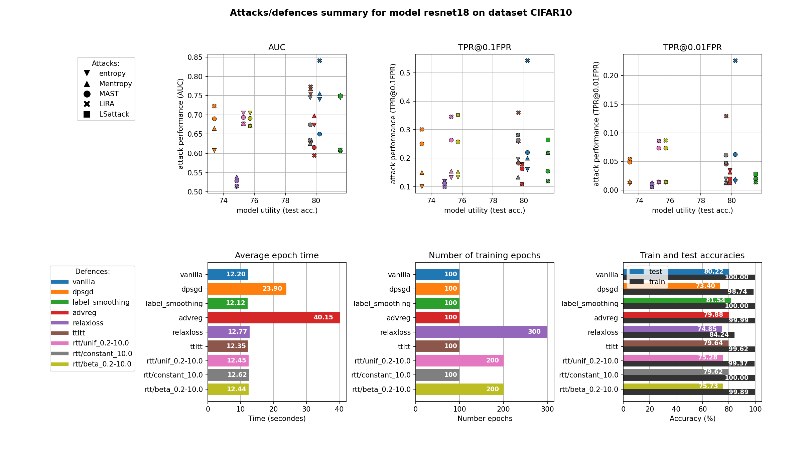

**MIAs and defences**
===

This packages enables to compare the effect of Membership Inference Attacks (MIAs) against different defence mechanisms, for different datasets and different models architectures.

For instance:

Currently implemented MIAs:   
*  Entropy and Modified-entropy from [Song et al. "Systematic Evaluation of Privacy Risks of Machine Learning Models" (2020)](https://arxiv.org/abs/2003.10595)
*  MAST from [Sablayrolles et al. "White-box vs Black-box: Bayes Optimal Strategies for Membership Inference" (2019)](https://arxiv.org/abs/1908.11229)
*  LiRA from [Carlini et al. "Membership Inference Attacks From First Principles" (2022)](https://arxiv.org/abs/2112.03570)

Currently implemented defences against MIAs:
*  Vanilla (undefended training)
*  DP-SGD from [Abadi et al. "Deep Learning with Differential Privacy" (2016)](https://arxiv.org/abs/1607.00133)
*  Label smoothing, see [towardsdatascience: What is label smoothing?](https://towardsdatascience.com/what-is-label-smoothing-108debd7ef06)
*  Adversarial regularization from [Nasr et al. "Machine Learning with Membership Privacy using Adversarial Regularization" (2018)](https://arxiv.org/abs/1807.05852)
*  RelaxLoss from [Chen et al. "RelaxLoss: Defending Membership Inference Attacks without Losing Utility" (2022)](https://arxiv.org/abs/2207.05801)
*  Random Temperature Tuning, personal idea: for each training sample $(x_i, y_i)$ draw a fixed temperature $t_i$ from a given temperature distribution $T$ so that each training sample is now a triple $(x_i, y_i, t_i)$. At training time, use these temperatures to rescale the softmax activation function at the output of the neural network, i.e., during training the outputted probabilities $\{p_{i, j}\}_{j\in 1, \dots, C}$ of sample $i$ are rescaled into $\tilde p_{i,j} := \frac{p_{i,j}^{1/t_i}}{\sum_j p_{i,j}^{1/t_i}}$. The loss is computed on these rescaled probabilities. At inference time, a temperature of $1$ is given to each sample. The idea was to introduce more randomness for a better defence, but without changing the probabilities relative ratios in order to preserve utility.

Available datasets:
*  CIFAR10
*  CIFAR100

Available model architectures:
*  Simple MLP with few layers
*  ResNet: resnet18, resnet50 ... ( **!!!** current ResNets use a kernel of size $3\times 3$ inside the first convolutional layer to work with the small $32\times 32$ px images of CIFAR)
*  VGG: vgg11, vgg13 ... (the versions using batch normalization are named vgg11_bn, vgg13_bn ...)

## **1. Running MIAs and defences**
### **1.1. Full defences-attacks-comparisons pipeline**

To run target models training, i.e. defences, then run MIAs in order to attack those defences, and to get finally a cross-comparison summary, use:  
>`python main.py --model resnet 18 --dataset CIFAR10 --random_seed 123 --defences all --attacks all`

If you just want to run some defences and/or some attacks, you can replace `all` with a space-seperated list of defences/attacks, like:   
> `python main.py --model resnet 18 --dataset CIFAR10 --random_seed 123 --defences vanilla dpsgd advreg --attacks Mentropy LiRA`

In case you just want to train the defences, or just run the attacks, or just perform the cross-comparisons between trained defences and attacks you can use the `--mode` option with respectively `defences`, `attacks` or `comparisons`. For instance:  
> `python main.py --model resnet 18 --dataset CIFAR10 --random_seed 123 --defences all --attacks all --mode comparisons`

To get further details about the options, you can have a look at the `parse_arguments()` function inside the `main.py` file.

### **1.2. Running files seperately**

In case you want to test defences or attacks alone, you can directly run the corresponding Python scripts, as describe hereunder.  
Nevertheless, notice that these standalone experiences are not directly managed from the `main.py` script, and that in case a complete pipeline is rerun from the `main.py` script, some of the standalone experiences might be relaunched/lost. In order to avoid an overwritting of an experiment, you can add a `done.txt` inside the results folder of that defence or attack, or you can use a different random seed.
***Using a different random seed is recommended for such standalone experiences.***

#### **1.2.1. Only defences**

Defences are located in the `defences/` folder. Details about specific defence parameters can be found in the `parse_arguments()` function of every defence. For example, to run a label smoothing training use:  
> `python defences/label_smoothing.py --model resnet18 --dataset CIFAR10 --random_seed 111 --nb_epochs 100`

#### **1.2.2. Only attacks**

For attacks, depending on the complexity of the attacks, one or two scripts are needed.

LiRA can be stopped and the relaunched of course, but no intermediate model weights are save for epoch time reduction.

## **2. Extending the package**

It is possible and supposed to be easy to extend this package in order to add other defences, other attacks, other datasets or other model arhcitecture. Here is a detailled explaination to add one of these:

### **2.1. How to add a dataset?**

### **2.2. How to add a model architecture?**

### **2.3. How to add a defence?**

### **2.4. How to add an attack?**

## **3. Details about implementations choices**
### Optimizer always Adam, ResNet a correcly tuned SGD with momentum and weight decay might be better
### How LiRA
### How MAST
### Where other codes come from
https://github.com/inspire-group/membership-inference-evaluation (adv reg)  
https://github.com/jinyuan-jia/MemGuard (memguard)  
https://github.com/DingfanChen/RelaxLoss (Relaxloss)

## **TODO**
*  Give dataset sizes
*  Add continue model training procedure
